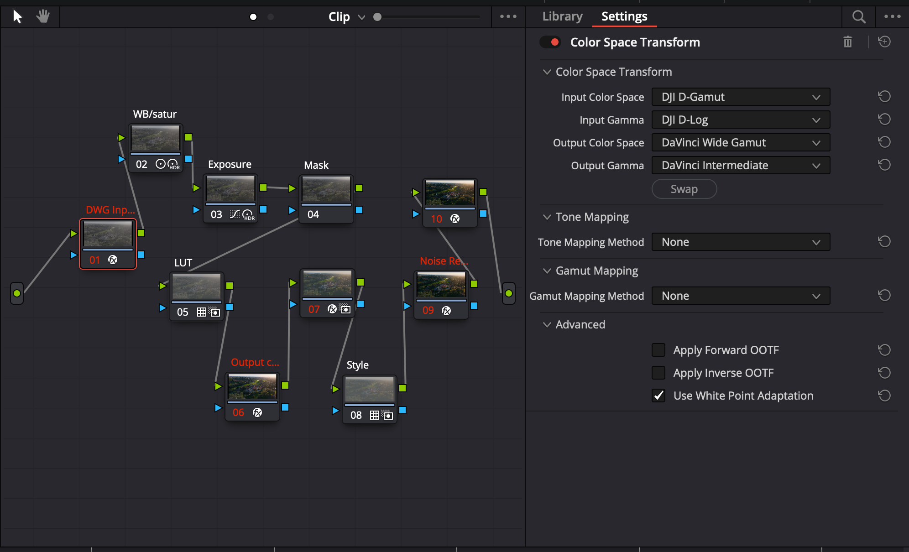
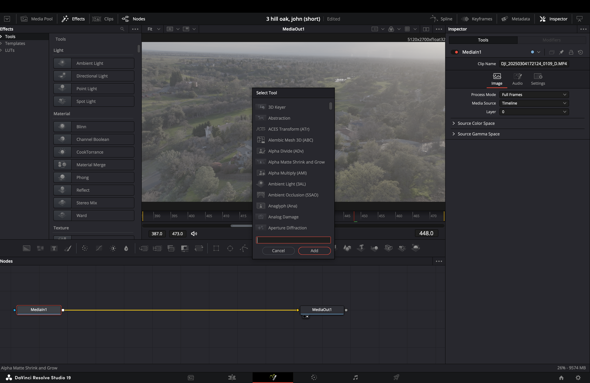

# DaVinci Resolve, The Ultimate Editing Software
### by Brandon Henman 3/14/25

A year ago, I grew frustrated with AAdobe [Premiere Pro](https://www.adobe.com/products/premiere.html)'s slow rendering and constant app-switching for color correction, audio, and VFX that I use for work in daily basis.  Switching to [DaVinci Resolve](https://www.blackmagicdesign.com/products/davinciresolve) changed everything. With all post-production tools in one place, my workflow became more intuitive and streamlined. This reduces **cognitive load** which is one of the UX principle of minimizing cognitive load, meaning reducing the mental effort needed to process tasks by keeping aesthetic simple and easy to follow. Now instead of juggling multiple applications, I can focus entirely on the creative process on Davinci software.

  
Another area where Resolve excels is its color grading tools. The node-based color workflow, it provides the best control over color correction, grading, and it makes the editing process fun! Unlike Premiere’s layers-based system, Resolve’s nodes allow for non-destructive, flexible grading, ensuring that every adjustment remains fully adjustable at any stage of the process. For someone working on mid to high end productions, this kind of control is indispensable. The software’s reliance on professional-grade color science is one reason why Hollywood colorists prefer Resolve over anything else.

  
When it comes to performance, DaVinci Resolve crushes the competition. Adobe Premiere, speaking from my exprience and others, often suffers from lag and crashes especially during rendering with 4-8K footages. Resolve, on the other hand, is optimized to utilize hardware more efficiently, making playback, rendering, and exporting much faster. This aligns with the UX principle of **"Efficiency of use"**—Resolve minimizes frustration by ensuring smooth operation, even when working on large projects.

  
Of course, no software is perfect. DaVinci Resolve does have a **learning curve**, and beginners may find its node-based color correction intimidating at first. However, once you get past that learning phase, the depth and power of Resolve become clear.

Overall, **DaVinci Resolve is not just a video editing software—it’s a full post-production powerhouse**. It’s the software that best matches the needs of professionals and enthusiasts alike, making it the clear winner over competitors like Premiere. If you're serious about video editing, there's simply no better choice!
